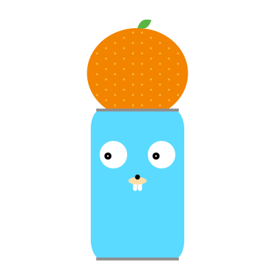

<div align="center">
  
</div>

# DajareGo

DajareGo provides checking a sentence if it is Dajare (Japanese pun).

[](./LICENSE)

[](https://pkg.go.dev/github.com/jugesuke/dajareGo)

[[日本語版Readmeはこちら]](./README.ja.md)

## Getting Started

### Usage

First, import DajareGo to your project.
```bash
go get github.com/jugesuke/dajareGo
```
```golang
import "github.com/jugesuke/dajareGo"
```

Next, load dictionary of tokenizer.

```golang
if err := dajareGo.Init(); err != nil {
  panic(err)
}
```

Next, use `IsDajare` function.
```golang
result := dajareGo.IsDajare("アルミ缶の上にあるミカン")
```

To get the result if the sentence is _Dajare_, use `result.IsDajare`.

```golang
result := dajareGo.IsDajare("アルミ缶の上にあるミカン")
if result.IsDajare {
  fmt.Println("This is Dajare")
} else {
  fmt.Println("This is not Dajare")
}
```
More information, please read [Document](https://pkg.go.dev/github.com/jugesuke/dajareGo/).

## Definition of _Dajare_
In this Package, _Dajare_ is defined the sentence contains pair(s) of words which has a similar reading but a different meaning.

## About logo
The Gopher character is based on the Go mascot designed by [Renée French](https://reneefrench.blogspot.com/).
